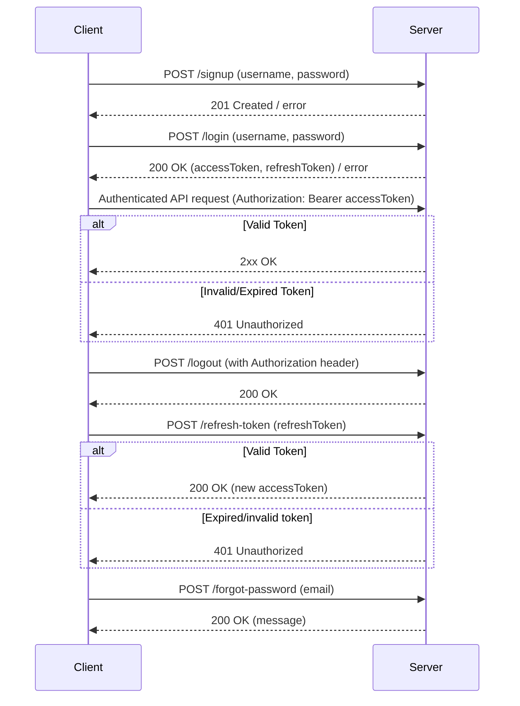

# User Authentication Backend API Documentation

This document provides a comprehensive guide to all RESTful API endpoints for the user authentication backend. It describes available endpoints, HTTP methods, required request/response payloads, authentication and authorization workflows, and the environment variables needed for the backend.

---
## Table of Contents

1. [Base URL](#base-url)
2. [Endpoints Overview](#endpoints-overview)
3. [Endpoint Details](#endpoint-details)
   - [/signup](#signup)
   - [/login](#login)
   - [/logout](#logout)
   - [/refresh-token](#refresh-token)
   - [/forgot-password](#forgot-password)
   - [Health Check /](#health-check-)
4. [Authentication Workflow](#authentication-workflow)
5. [Environment Variables](#environment-variables)
6. [Error Responses](#error-responses)

---

## Base URL

By default, the API server runs at:  
`http://localhost:3000/`  
(Port and host are configurable via environment variables.)

The OpenAPI spec and Swagger documentation are available at `/docs`.

---

## Endpoints Overview

| Method | Path              | Description                         | Authentication   |
|--------|-------------------|-------------------------------------|------------------|
| POST   | /signup           | Register a new user                 | ❌ No            |
| POST   | /login            | Log in and get JWT tokens           | ❌ No            |
| POST   | /logout           | Blacklist access token (log out)    | ✅ Yes (JWT)     |
| POST   | /refresh-token    | Get new access token (via refresh)  | ❌ No            |
| POST   | /forgot-password  | Initiate password reset             | ❌ No            |
| GET    | /                 | Health check                        | ❌ No            |

---

## Endpoint Details

### POST /signup

**Description**: Register a new user account.

**Request Body** (`application/json`):
```json
{
  "username": "user@example.com",
  "password": "P@ssw0rd!"
}
```

- `username`: string, required.
- `password`: string, required. Minimum 8 characters, must include at least one special character.

**Responses:**
- `201 Created`: `{ "message": "User registered successfully" }`
- `400 Bad Request`: Required parameters missing or password too weak.
- `409 Conflict`: `{ "message": "Username already taken" }`
- `500 Internal Server Error`: Registration failed.

---

### POST /login

**Description**: Authenticate user and obtain tokens.

**Request Body** (`application/json`):
```json
{
  "username": "user@example.com",
  "password": "P@ssw0rd!"
}
```

**Responses:**
- `200 OK`:
  ```json
  {
    "accessToken": "<JWT_ACCESS_TOKEN>",
    "refreshToken": "<JWT_REFRESH_TOKEN>"
  }
  ```
- `400 Bad Request`: Required parameters missing.
- `401 Unauthorized`: Invalid username or password.

---

### POST /logout

**Description**: (JWT-protected) Blacklist the current access token.  
**Headers**:
- `Authorization: Bearer <accessToken>`

**Request Body**: _none_

**Responses:**
- `200 OK`: `{ "message": "Logged out successfully" }`
- `401 Unauthorized`: Missing/invalid/expired token.

_Note: Blacklisting is only temporary (in-memory set) and resets on server restart._

---

### POST /refresh-token

**Description**: Exchange a valid refresh token for a new access token.

**Request Body** (`application/json`):
```json
{
  "refreshToken": "<JWT_REFRESH_TOKEN>"
}
```

**Responses:**
- `200 OK`:
  ```json
  {
    "accessToken": "<NEW_ACCESS_TOKEN>"
  }
  ```
- `400 Bad Request`: `{ "message": "Refresh token required" }`
- `401 Unauthorized`: Invalid or expired token.

---

### POST /forgot-password

**Description**: Initiate password reset via email ("username" acts as email).

**Request Body** (`application/json`):
```json
{
  "email": "user@example.com"
}
```

**Note**: This endpoint always returns a generic message for security.

**Responses:**
- `200 OK`:  
  `{ "message": "If a user with that email exists, a reset link has been sent." }`
- `400 Bad Request`: Email not provided.

---

### GET /

**Description**: Health check endpoint.

**Request**: _none_

**Response:**
```json
{
  "status": "ok",
  "message": "Service is healthy",
  "timestamp": "2024-01-01T10:00:00.000Z",
  "environment": "development"
}
```

---

## Authentication Workflow

1. **Signup**:  
   The user registers with a username and password via `/signup`. Passwords must be at least 8 characters and contain a special character.

2. **Login**:  
   The user logs in with username and password via `/login`.  
   On success, both an `accessToken` (JWT, default expiry 15min) and `refreshToken` (JWT, default expiry 7 days) are issued.

3. **Authenticated Requests**:  
   - The `accessToken` is passed in the `Authorization: Bearer <token>` header for protected routes (e.g., `/logout`).
   - The server validates the access token for each request using middleware.

4. **Logout**:  
   The user sends a request to `/logout` with their access token in the header. The token is added to a server-side blacklist.

5. **Token Refresh**:  
   The user can exchange a valid, unexpired refresh token for a new access token using `/refresh-token`.

6. **Password Reset** (demo):  
   Via `/forgot-password`, a reset token is generated (if the user exists). An email is theoretically sent (mocked in dev; uses configured email backend in real deployments). The reset URLs/links depend on environment variables (see below).

---

## Environment Variables

Below are the main environment variables affecting the API and authentication logic:

| Variable                 | Purpose                                      | Default                  | Required |
|--------------------------|----------------------------------------------|--------------------------|----------|
| `PORT`                   | Server listening port                        | `3000`                   | No       |
| `HOST`                   | Server hostname/IP                           | `'0.0.0.0'`              | No       |
| `JWT_SECRET`             | Secret key for access token signing          | _none_                   | **Yes**  |
| `JWT_EXPIRES_IN`         | Access token expiry duration                 | `'15m'`                  | No       |
| `JWT_REFRESH_SECRET`     | Secret key for refresh tokens (can match JWT_SECRET) | `JWT_SECRET`              | No       |
| `JWT_REFRESH_EXPIRES_IN` | Refresh token expiry duration                | `'7d'`                   | No       |
| `EMAIL_API_KEY`          | Outbound email provider API key              | _none_                   | No, if not sending real email |
| `EMAIL_FROM`             | Email sender address for password reset      | `'noreply@example.com'`  | No       |
| `SITE_URL`               | Base URL for constructing password reset links| `'http://localhost:3000'`| No       |
| `NODE_ENV`               | Node environment                             | `'development'`          | No       |

**Note**:  
If `EMAIL_API_KEY` is not set, password reset emails are mocked (printed to console).

---

## Error Responses

Unless otherwise specified, error responses follow this format:

```json
{
  "message": "<description of error>",
  // "error": "<optional detailed error for debugging>"
}
```

Common possible status codes include:
- `400 Bad Request` (missing parameters, weak password)
- `401 Unauthorized` (invalid credentials or token)
- `409 Conflict` (duplicate user)
- `500 Internal Server Error` (unexpected or unhandled server errors)

---

## Mermaid Diagram: Authentication Flow



---

For additional details and to try out the API, visit `/docs` on the running server.

